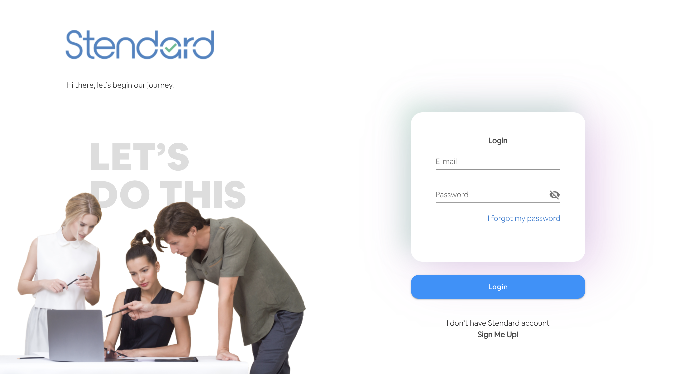
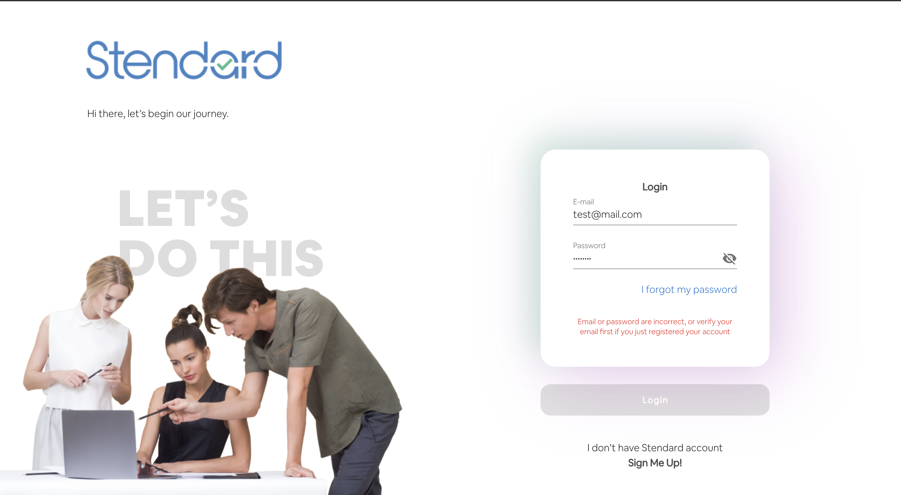
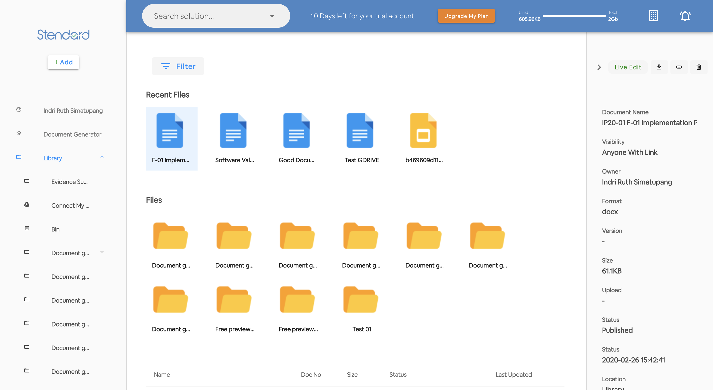
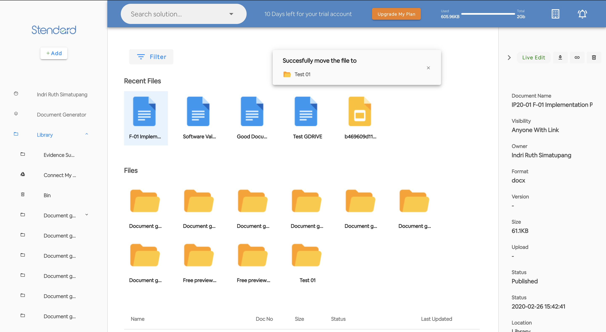
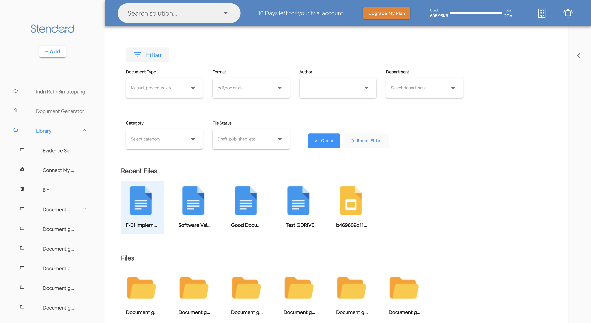

# login-and-library-app

Admin Dashboard using Vue js

## Project setup
```
npm install
```

### Compiles and hot-reloads for development
```
npm run serve
```

## Screen Capture

**Login page** 



**Login page - wrong password**



**Dashboard Default**



**Move File Alert**



**Open filter options**


